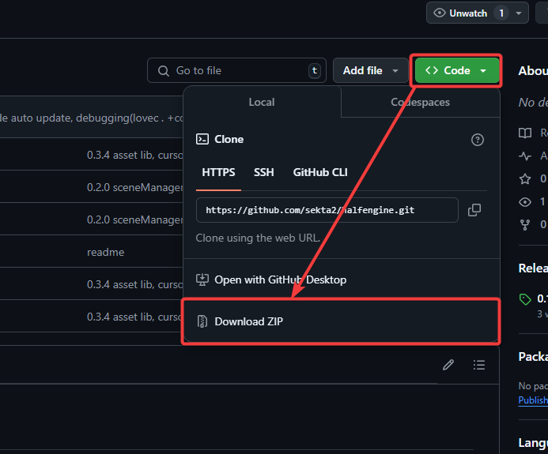

# halfengine

HalfEngine is an engine based on the LOVE2D framework for creating games, 2D for now

It makes it pretty easy to create games, it's already out of the box:

[0.5rfs]
- GameObject(no components)
- Class system
- Scene Manager
- Physics Wrapper(In the process of finalization)
- Asset Manager

## Usage

1. Download the engine repository, click on the Code button, there will be a Download ZIP button below.

2. Change the config in `game/config.lua`, you can change the size of the game window, make full screen mode, and also it is important to change the ID of your game (something like an abbreviation of the name) and the name itself.

3. Watch [Documentation](.docs/README.md) and [FAQ](.docs/FAQ.md) and start developing your game!

## Notes
1. Physics Wrapper - something like Box2D in LOVE2D. Allows you to create circle, square and other primitives with a single function.
2. GameObject - The name from Unity that denotes a game object, here it is a service (manager if easier) to work with the entity and other things.